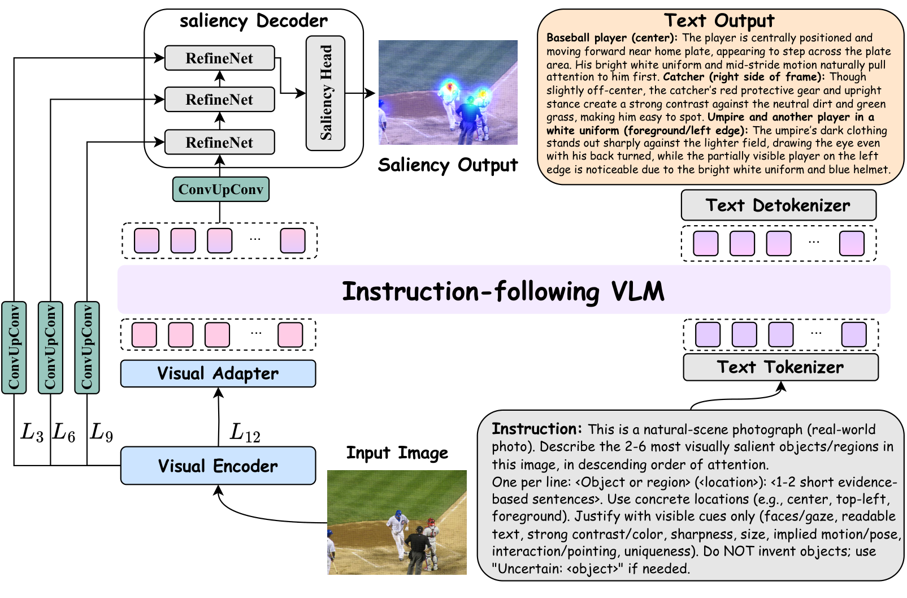
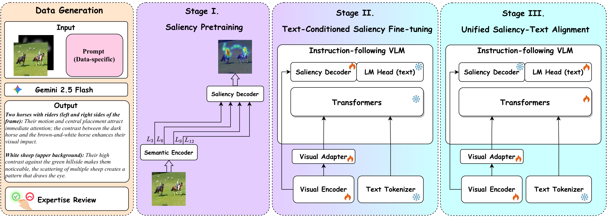

<div align="center">


[](assets/arch2.pdf)
[](https://huggingface.co/datasets/K-Hooshanfar/OpenVAM)
[](LICENSE)
[](https://www.python.org/)
[](https://pytorch.org/)

</div>

> *Predicting human gaze is a core capability for applications ranging from web/UI design analysis to robotics and human-computer interaction. Yet most visual attention models output only a dense saliency map, which is often insufficient for action: practitioners need to connect attention peaks to discrete elements in the scene (**what**) and understand the drivers of those peaks in context (**why**), while remaining robust to domain shift across natural images, commercial content, and UI/web layouts. We introduce **OpenVAM** (**Open**-world **V**isual **A**ttention **M**odeling with VLMs), a unified framework that jointly addresses universality and explainability across heterogeneous domains and supervision modalities. OpenVAM adopts a **decoupled-but-aligned** design: a dedicated dense visual pathway provides stable, spatially precise localization, while an instruction-following vision–language semantic head generates grounded what/why explanations conditioned on the same image and a data-type prompt. A three-stage training strategy preserves strong localization priors while progressively introducing language grounding via parameter-efficient adaptation, without perturbing the saliency branch. We further propose a scalable pipeline to generate multi-domain saliency-reason annotations. Experiments across diverse datasets show that OpenVAM improves robustness under domain shift while producing image-grounded explanations that make saliency predictions more interpretable.*

<div align="center">
  
  <br>
  <em>Overview of the <b>OpenVAM</b> architecture: a DINOv3 visual encoder feeds a coarse-to-fine saliency decoder (where) and, through a visual adapter, an instruction-following VLM that produces grounded what/why explanations.</em>
</div>

---

## 💥 News 💥

- **[2026-06]** Initial release of the OpenVAM codebase

---

## Highlights

- **Unified across domains** — a single model for natural scenes, commercial imagery, and UI/web layouts.
- **Predicts *where* and explains *what/why*** — a dense saliency map plus a grounded natural-language description.
- **Decoupled-but-aligned** — a stable dense visual pathway is never entangled with language dynamics.
- **Three-stage training** — localization priors are preserved while language grounding is added via LoRA.

---

## Architecture

| Component | Paper term | Role |
|-----------|------------|------|
| **DINOv3** (ViT-B/16) | Visual Encoder | Multi-level features tapped at layers $L_3, L_6, L_9, L_{12}$ |
| **ConvUpConv projection** | Feature pyramid | Builds the 4-level pyramid from tapped layers |
| **Coarse-to-fine decoder** | Saliency Decoder | RefineNet-style fusion (DPT-inspired) → dense saliency map |
| **Qwen-VL + visual adapter** | Vision-Language Semantic Head | Generates grounded *what/why* explanations |
| **LoRA** | Stage III adaptation | Parameter-efficient tuning of the language side |

Layers $L_3, L_6, L_9$ feed the saliency decoder (spatial precision), while $L_{12}$ — the most semantically abstract representation — is passed through the visual adapter into the VLM for cross-modal alignment, so the dense saliency features are never entangled with language dynamics.

See [`ARCHITECTURE.md`](ARCHITECTURE.md) for the detailed module-level description.

---

## Installation

Ensure you have **Python ≥ 3.10** installed.

**Option A — Conda (recommended, Linux/WSL):**
```bash
conda env create -f openvam.yml
conda activate dino
```

**Option B — pip:**
```bash
python -m venv .venv
source .venv/bin/activate   # Windows: .venv\Scripts\activate
pip install -r requirements.txt
```

Install PyTorch with CUDA 12.4:
```bash
pip install torch==2.6.0 torchvision==0.21.0 torchaudio==2.6.0 \
    --index-url https://download.pytorch.org/whl/cu124
```

The saliency-decoder building blocks live in the `DPT/` subdirectory and are imported directly (`from DPT.dpt.models import DPT`) — no extra install step is required as long as you run scripts from the repo root.

### Hugging Face access token

The DINOv3 backbone (`facebook/dinov3-vitb16-pretrain-lvd1689m`) and the Qwen-VL models are gated/downloaded from the Hugging Face Hub. **You must supply your own access token** — none is bundled with the code. Request access on the model pages, then export your token before running any script:

```bash
export HF_TOKEN=hf_your_token_here          # Linux / macOS
# setx HF_TOKEN "hf_your_token_here"         # Windows (PowerShell, new shell needed)
```

The scripts read the token from `HF_TOKEN` (or `HUGGING_FACE_HUB_TOKEN`); inference scripts also accept a `--hf_token` flag.

---

## Training

OpenVAM is trained in **three stages**; each stage initializes from the previous one.

<div align="center">
  
  <br>
  <em>Data generation pipeline and the three-stage training strategy.</em>
</div>

### Stage I — Saliency localization (visual pathway only)

Train the DINOv3 encoder + coarse-to-fine saliency decoder with saliency supervision only, to learn a strong, domain-agnostic localization prior.

```bash
python scripts/train_stage1_saliency.py \
    --train_jsonl datasets/salicon_256_train.jsonl \
    --val_jsonl   datasets/salicon_256_val.jsonl \
    --saliency_dir /path/to/saliency_maps \
    --fixation_dir /path/to/fixation_maps \
    --output_dir   checkpoints/stage1
```

### Stage II — Attach the VLM, train the visual side

Starting from the Stage-I model, attach the instruction-following Qwen-VL semantic head. The language backbone stays **frozen**; only the DINOv3 encoder, saliency decoder, and the visual adapter are optimized.

```bash
python scripts/train_stage2_visual.py \
    --pretrained_checkpoint checkpoints/stage1/best_model.pth \
    --train_jsonl datasets/salicon_256_train.jsonl \
    --val_jsonl   datasets/salicon_256_val.jsonl \
    --saliency_dir /path/to/saliency_maps \
    --fixation_dir /path/to/fixation_maps \
    --output_dir   checkpoints/stage2
```

### Stage III — Freeze saliency, LoRA-adapt the VLM

Freeze the saliency pathway (encoder + decoder) and optimize only the language side: the visual adapter stays trainable, and LoRA is applied to the language transformer, the LM head, and the required norms. This sharpens the grounded explanations while preserving localization.

```bash
python scripts/train_stage3_lora.py \
    --pretrained_checkpoint checkpoints/stage2/best_model_vision_first.pth \
    --train_jsonl datasets/salicon_256_train.jsonl \
    --val_jsonl   datasets/salicon_256_val.jsonl \
    --saliency_dir /path/to/saliency_maps \
    --fixation_dir /path/to/fixation_maps \
    --lora_r 8 --lora_alpha 16 \
    --output_dir checkpoints/stage3
```

Multi-GPU (DDP):
```bash
torchrun --nproc_per_node=4 scripts/train_stage3_lora.py [same args]
```

### Training objective

OpenVAM uses a composite saliency loss combining distributional and structural terms, plus an autoregressive text loss in Stage III:

$$\mathcal{L}_{\text{sal}} = \lambda_1 \mathcal{L}_{\text{KL}} + \lambda_2 \mathcal{L}_{\text{CC}} + \lambda_3 \mathcal{L}_{\text{SIM}} + \lambda_4 \mathcal{L}_{\text{NSS}} + \lambda_5 \mathcal{L}_{\text{MSE}}$$

**Stage I / II:**

$$\mathcal{L} = \mathcal{L}_{\text{sal}}$$

**Stage III** *(no gradients flow into the frozen saliency branch)*:

$$\mathcal{L} = \alpha\,\mathcal{L}_{\text{sal}} + \beta\,\mathcal{L}_{\text{text}}$$

All saliency terms are implemented in [`utils/losses.py`](utils/losses.py).

---

## Inference

**Single image (saliency map + explanation):**
```bash
python scripts/inference.py \
    --checkpoint checkpoints/stage3/best_model.pth \
    --image path/to/image.jpg
```

**Batch explanation generation on a val JSONL:**
```bash
python scripts/inference_batch.py \
    --checkpoint checkpoints/stage3/best_model.pth \
    --val_jsonl  datasets/salicon_256_val.jsonl \
    --output_dir results/
```

---

## Evaluation

Per-dataset saliency metrics (KLD / CC / SIM / NSS / AUC) on the validation split:

```bash
python scripts/eval_per_dataset.py \
    --checkpoint checkpoints/stage3/best_model.pth \
    --val_jsonl  datasets/salicon_256_val.jsonl \
    --saliency_dir /path/to/saliency_maps \
    --fixation_dir /path/to/fixation_maps
```

`scripts/eval_per_dataset.py` automatically detects whether a checkpoint is a Stage-I `OpenVAMSaliencyNet` (saliency only) or a full `OpenVAM` model.

---

## Datasets

### 1. Download stimuli, saliency maps, and fixations

Download the packed multi-domain saliency datasets from Google Drive and extract them so each dataset folder is reachable by the paths in the JSONL files:

- **[saliency_datasets.zip](https://drive.google.com/file/d/1Mdk97UB0phYDZv8zgjBayeC1I1_QcUmh/view?usp=drive_link)**

### 2. Download train/val JSONL files

The train and val JSONL annotation files are published on Hugging Face: [K-Hooshanfar/OpenVAM](https://huggingface.co/datasets/K-Hooshanfar/OpenVAM). Download them into `datasets/` before merging:

```bash
huggingface-cli download K-Hooshanfar/OpenVAM \
    --repo-type dataset \
    --include "*.jsonl" \
    --local-dir datasets
```

If the dataset page asks you to accept access terms, log in with the same `HF_TOKEN` from the installation section, then rerun the command.

Each file provides an image path and a grounded saliency explanation across multiple domains:

| Dataset | Domain |
|---------|--------|
| SALICON | natural scenes |
| CAT2000 | natural scenes |
| MIT1003 | natural scenes |
| OSIE    | natural scenes |
| SalEC   | commercial imagery |
| UI-256  | web / UI layouts |

### 3. Merge before training (required)

**Do not train on the raw per-dataset folders directly.** After downloading the Drive archive and the JSONL files, merge them into a unified `train`/`val` layout with [`datasets/merge_datasets_unified.py`](datasets/merge_datasets_unified.py). The script copies (or moves) stimuli, saliency maps, and fixations, rewrites paths, and writes `merged_train.jsonl` / `merged_val.jsonl` with dataset-prefixed IDs (e.g. `CAT2000_256_Action_001`):

```bash
# Run on the machine where the extracted image files live
python datasets/merge_datasets_unified.py \
    --datasets_dir datasets \
    --out_dir /path/to/merged
```

Then point training / evaluation at the merged outputs:

```bash
--train_jsonl /path/to/merged/merged_train.jsonl \
--val_jsonl   /path/to/merged/merged_val.jsonl \
--saliency_dir /path/to/merged \
--fixation_dir /path/to/merged
```

Each JSONL entry follows the format:

```json
{
  "id": "COCO_val2014_000000000133",
  "image": "/path/to/stimuli/image.jpg",
  "conversations": [
    {"role": "user",      "content": "Predict the salient regions in this image. And why?"},
    {"role": "assistant", "content": "Wooden loft bed (center): high contrast, central position..."}
  ],
  "metadata": {"salience_explanation": "..."}
}
```

Following the paper, the grounded *what/why* annotations were generated with a data-type prompt using Gemini 2.5 Flash and then expert-reviewed for quality control.

---

## Repository Structure

```
.
├── net/                                  # Model definitions
│   ├── openvam.py                        #   OpenVAM (DINOv3 + saliency decoder + Qwen-VL semantic head)
│   ├── openvam_qwen_vit.py               #   Variant using Qwen's native ViT instead of DINOv3
│   └── saliency_net.py                   #   OpenVAMSaliencyNet: Stage-I dense pathway only
│
├── utils/                                # Shared utilities
│   ├── losses.py                         #   KL-div, CC, SIM, NSS, MSE saliency losses
│   └── data.py                           #   Dataset classes and image preprocessing
│
├── scripts/                              # Command-line entrypoints
│   ├── train_stage1_saliency.py          #   Stage I:  saliency localization (visual pathway only)
│   ├── train_stage2_visual.py            #   Stage II: attach VLM, train encoder/adapter/decoder
│   ├── train_stage3_lora.py              #   Stage III: freeze saliency, LoRA-adapt the VLM
│   ├── eval_per_dataset.py               #   Per-dataset KLD/CC/SIM/NSS/AUC evaluation
│   ├── validation.py                     #   Directory-based evaluation against GT maps
│   ├── inference.py                      #   Single-image saliency + explanation
│   ├── inference_batch.py                #   Batch explanation generation on a val JSONL
│   ├── stage1_explain.py                 #   Stage-I saliency → Qwen explanation pipeline
│   └── sample_folder_explain.py          #   Standalone Qwen explanation over a folder
│
├── datasets/                             # JSONL annotation files (no images)
│   ├── merge_datasets_unified.py         #   Merge per-dataset splits into a unified layout
│   └── *.jsonl                           #   Per-dataset train/val JSONL files
├── DPT/                                  # DPT decoder building blocks (local package)
├── assets/                               # Figures for docs (arch2 + stages_training2, PDF/PNG)
│
├── dino.yml                              # Conda environment (Linux)
├── requirements.txt                      # pip requirements
├── ARCHITECTURE.md                       # Detailed architecture documentation
└── README.md
```

---

## Citation

```bibtex
@article{hooshanfar2026openvam,
  title={OpenVAM: Open-World Visual Attention Modeling with VLMs},
  author={Hooshanfar, Kiana and Kazerouni, Amirhossein and Hosseini, Alireza and Brudno, Michael and Taati, Babak},
  journal={arXiv preprint arXiv:2609.31364},
  year={2026}
}
```

---

## License

This project is released under the [MIT License](LICENSE).

The `DPT/` subdirectory contains Intel's [DPT](https://github.com/isl-org/DPT) code, licensed under the MIT License (see `DPT/LICENSE`).
